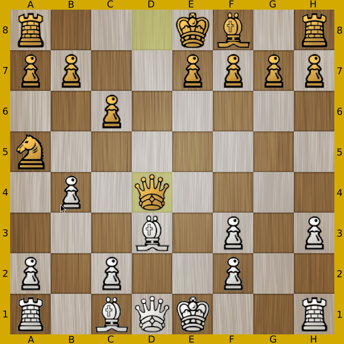

# Chess

Chess Game by M. Nahin Khan.
27/11/2016
Make sure Python is installed.
Make sure pygames library is installed.
Make sure the Media folder exists.
Run chess.py

Changes by schreibfaul1:
runs in Python3 (tested OS: Win10 and Linux Mint)
new design

